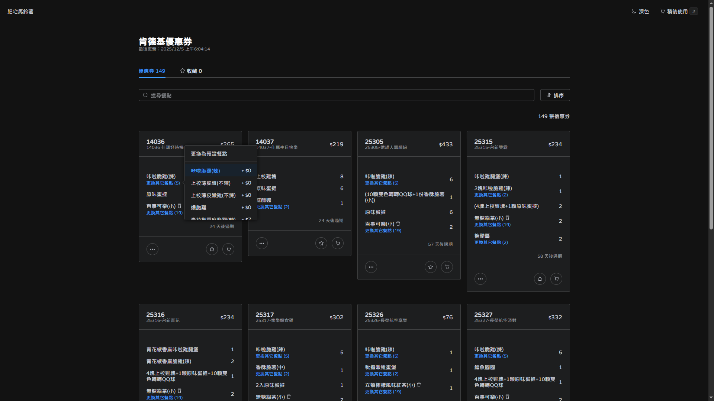
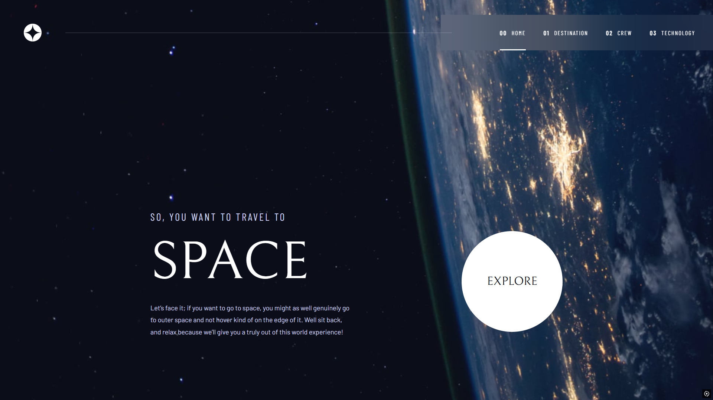

# 作品集

## 肯德基優惠券網站

每天實時更新的線上優惠券網站，開發框架與語言使用 Nuxt 3 跟 TypeScript，組件與樣式使用 Element Plus + UnoCSS，並且將資料存到 MongoDB 的雲端服務 Atlas 上，同時也使用 Github Actions 定時每日撈取優惠券資料。 

[網誌文章](./kfc-coupons-website/index.md)

## Space Tourism 網站切版

網站切版練習，主要使用 Nuxt 3 + UnoCSS，並且使用 Tailwind 的 Preflight 重置所有瀏覽器的預設 CSS，並部署於 Vercel。

[網誌文章](./space-tourism/index.md)