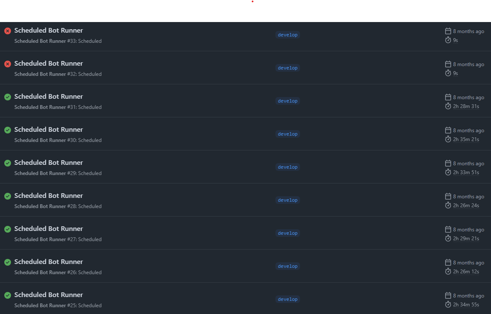
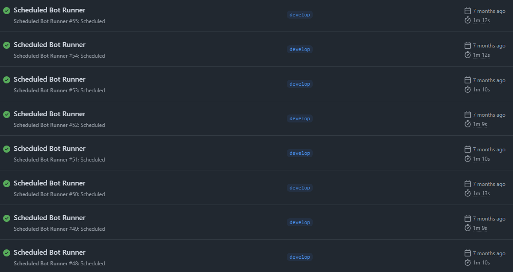

# 肯德基優惠券網站

## 介紹
身為一個愛吃垃圾食物的工程師當然也要自己弄一個優惠券網站 %116%

- [線上網址](https://www.fatato.site/)


## 技術選擇
- Nuxt 3 / TypeScript
- Element Plus / Uno CSS / Normalize.css
- Pinia / [Pinia persisted state](https://github.com/prazdevs/pinia-plugin-persistedstate)
- Mongo DB / Mongo Atlas
  - 將優惠券資料送到 Mongo DB 的雲端 Atlas 上儲存
- Github Actions
  - 主要是把用來執行搜尋的腳本掛在 Workflows 底下每天自動執行


## 最佳化

### 撈取優惠券
由於肯德基網站是前後端分離的結構，在[優惠券頁面](https://www.kfcclub.com.tw/coupon)查詢優惠券時會發出以下 API 分別請求資料：

`POST /checkCouponProduct` - 確認優惠券是否可用
`POST /getEVoucherAPI` -  取得優惠券的基本資料
`POST /GetQueryFoodDetail` - 取得餐點代碼的相關資料

所以我的做法是撰寫[腳本](https://github.com/DahisC/PKCoupon/blob/develop/bot/index.ts)撈取這些優惠券，再存到雲端資料庫上就完成了

但由於腳本的執行時間與 Github Actions 的免費額度有關，所以針對這部分也有做最佳化


### Github Actions 與免費額度
首先，由於我們需要定期同步優惠券資料到資料庫，所以也需要一個定時執行的方法

這時候 Github Actions 就可以很簡單地達到這個需求，所以我寫了一支 [workflow](https://github.com/DahisC/PKCoupon/blob/develop/.github/workflows/bot-schedule.yml) 定時在每天早上 6 點執行專案底下的 `bot.ts` 腳本


根據[這篇文章的說明](https://docs.github.com/en/billing/concepts/product-billing/github-actions)，每個 Github 帳號可以免費使用的時間是一個月 2000 分鐘，所以腳本的速度提升勢在必行
**
一開始沒注意到有限制，所以撈優惠券的速度是平均**一次約 150 分鐘**
所以在撈沒幾次之後就達到額度上限被停用了XD



在注意到這個情況之後我發了一個重構的 [Commit](https://github.com/DahisC/PKCoupon/commit/9678ff603b1d696d455424ffef345f99eb2d1dd1)

主要是將原本 `for` + `await` 逐筆搜尋的方式改成使用 `Promise.all`，並且不等待上一次的結果



最佳化過的搜尋效率，則是**一次約 70 秒**，大幅降低了我們需要付費給 Github 的機率 %134%

### 節省後端資源

由於前端現在是在進入頁面時發一支 API 到 Nuxt 的後端，後端再發請求給雲端資料庫的 Atlas 把優惠券取回來給前端，所以使用者如果在網站上一直重新整理，就會一直重複這個過程

但由於優惠券是每天更新一次，所以其實可以做一個簡單的機制避免使用者觸發這種情況

```ts
async function initCoupons() {
      async function fetchUpdateInfo(): Promise<UpdateInfo> {
        const data = await $fetch<UpdateInfoAPIRes>('/api/updateInfo');
        return data.updateInfo;
      }

      async function fetchCoupons(): Promise<Coupon[]> {
        const data = await $fetch<CouponAPIRes>('/api/coupon');

        return data.coupons.map(convertRawCouponToCoupon);
      }

      async function syncCouponsToLocal() { // [!code focus]
        const serverCoupons = await fetchCoupons(); // [!code focus]
        coupons.value = serverCoupons; // [!code focus]
      }

      try {
        isFetching.value = true;

        const serverUpdateInfo = await fetchUpdateInfo();
        updateInfo.value = serverUpdateInfo;

        if (!updateInfo.value) throw new Error('NoUpdateInfo'); // [!code focus]

        if (!coupons.value.length) throw new Error('NoCoupons'); // [!code focus]
        if (coupons.value.length !== updateInfo.value.inserted) throw new Error('InsertedNotMatch'); // [!code focus]
        if (serverUpdateInfo.updatedTime !== updateInfo.value.updatedTime) throw new Error('UpdateTimeNotMatch'); // [!code focus]
      } catch (error) {
        await syncCouponsToLocal(); // [!code focus]
      } finally {
        isFetching.value = false;
      }
    }
```

在撈優惠券的腳本 bot.ts 中，每次撈完優惠券都會同時將時間戳記與優惠券寫進資料庫中儲存，而前端在每次進入網站時，都會先比對以下幾個地方才決定要不要發 API 取得資料：

1. 沒有更新時間
2. 沒有優惠券資料
3. 前端儲存的優惠券筆數與資料庫不相符
4. 前端儲存的更新時間與資料庫不相符

只要這些比對條件其中一個地方不相符，就會發 API 重新同步優惠券資料